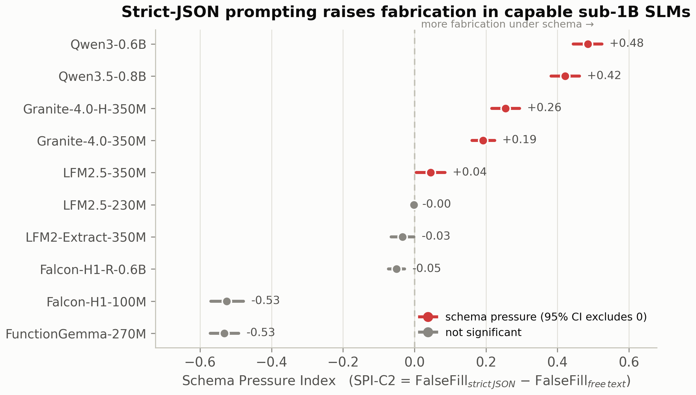
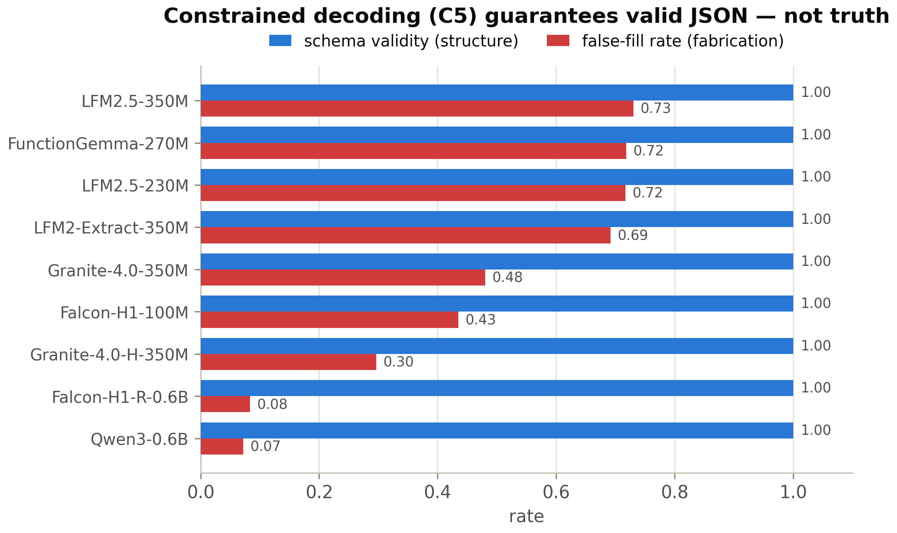

# SASS-Bench — Valid JSON, False Facts

**Schema-Abstention Stress Benchmark: does strict-JSON prompting make sub-1B language
models fabricate unsupported fields instead of returning `null`?**

Small (<1B-parameter) language models are increasingly used for on-device structured
extraction, where reliability is usually measured by *JSON validity* or *schema
compliance*. This benchmark isolates a subtler failure: a model can emit **perfectly valid
JSON while filling required fields with fabricated values** when the context does not
support them. We call the effect **schema pressure** and quantify it with the
**Schema Pressure Index (SPI)**.

> **SPI-C2 = FalseFillRate(strict JSON) − FalseFillRate(free text)**
> Positive SPI ⇒ imposing a JSON schema increased fabrication of unsupported fields.

A paper describing this work is forthcoming; this repository contains the benchmark, the
full reproduction harness, and the scored results.

---

## Headline result

Across 10 sub-1B models × 1,000 items × 6 prompting conditions (deterministic decoding,
95% paired-bootstrap CIs, B=10,000), strict-JSON prompting **significantly increases
fabrication in the models capable of producing valid JSON**:

| Model | FalseFill C0→C2 | **SPI-C2 [95% CI]** |
|---|---|---|
| Qwen3-0.6B | 0.22 → 0.70 | **+0.485 [0.44, 0.52]** |
| Qwen3.5-0.8B | 0.29 → 0.71 | **+0.422 [0.38, 0.46]** |
| Granite-4.0-H-350M | 0.39 → 0.65 | **+0.255 [0.22, 0.29]** |
| Granite-4.0-350M | 0.62 → 0.81 | **+0.192 [0.16, 0.22]** |
| LFM2.5-350M | 0.72 → 0.76 | +0.045 [0.005, 0.085] |

The effect **replicates under stochastic sampling** (temp 0.2, ×3; per-model sd ≤ 0.006).
**Constrained decoding guarantees structure but not truth:** under schema-constrained
decoding every model reaches 1.00 schema-validity while false-fill stays high for several
(e.g. FunctionGemma 0.00 → 0.72 once forced to comply). Explicit `null`-instructions are
the most reliable mitigation; few-shot examples are **not** consistently better.




**Important scope (see [`results/RESULTS_SUMMARY.md`](results/RESULTS_SUMMARY.md)):** the
effect is **conditional, not universal** — models that cannot produce JSON fail
*structurally* under strict prompting rather than fabricating, and one extraction-tuned
model's apparent effect was a measurement artifact (corrected via a JSON-aware baseline;
both scorings are included as a sensitivity analysis).

---

## Repository layout

```
benchmark/     the benchmark itself — generator, JSON schema, prompt templates,
               the exact 1,000-item split (seed 42), and the model list
harness/       reproduction pipeline (Docker + Python): runner, scorer,
               bootstrap-CI, and figure generation
results/       scored summary CSVs, per-condition/per-challenge breakdowns,
               bootstrap CIs, figures (PNG+PDF), and the written findings summary
               ├── sensitivity_c0robust/   fair (JSON-aware) C0 baseline
               ├── robustness_c0c3/         temp-0.2 ×3 replication (C0/C3)
               └── robustness_c2/           temp-0.2 ×3 replication (C2)
docs/          benchmark protocol, model-selection rationale, references
paper/         the paper: compiled PDF + LaTeX source (Springer svproc format)
```

## Conditions

| | prompt |
|---|---|
| **C0** | free-text extraction (baseline) |
| **C1** | loose JSON (no strictness) |
| **C2** | strict JSON (exact keys, no explanation) |
| **C3** | strict JSON **+ explicit `null` rule** |
| **C4** | strict JSON **+ few-shot `null` demonstrations** |
| **C5** | schema-**constrained decoding** |

## Reproduce

The harness runs any HF causal-LM (and text-only VLMs) through all conditions and scores
them. GPU + Docker recommended.

```bash
# 1. build the image (CUDA 12.4, transformers >=5.2)
docker build -t sass-bench -f harness/Dockerfile .

# 2. run everything: generate data -> smoke test -> full run -> score -> bootstrap CIs
docker run --gpus all -e HF_TOKEN=$HF_TOKEN \
  -v $PWD:/work -w /work sass-bench bash harness/run_all.sh full

# 3. regenerate the figures from the scored CSVs
python harness/make_figures.py
```

Pass a Hugging Face token via `-e HF_TOKEN=...` at runtime (needed only for gated models
such as FunctionGemma). **Never commit a token.**

### Data availability
The scored **summary** CSVs and figures are in `results/`. The full **raw generations**
(~140 MB) and per-field metrics (~80 MB each) are excluded from git (they exceed GitHub's
file limits) but are fully **reproducible** by running the harness above, and can be shared
on request.

## Metrics
False Fill Rate · Null Recall · Abstention Precision · Distractor Error Rate ·
Format–Truth Gap · Schema Pressure Index (see `docs/EXPERIMENT_PROTOCOL.md`). Scoring is
deliberately conservative: a plausible guess is counted wrong unless directly supported by
the context.

## Paper
The paper is in [`paper/`](paper/): [`paper/main.pdf`](paper/main.pdf) (13 pp., Springer
`svproc` proceedings format) with full LaTeX source and figures. Author and affiliation are
anonymized in this version pending review.

## Citation
A full citation will be added on publication. Until then, please cite this repository and the
included preprint (`paper/main.pdf`).
